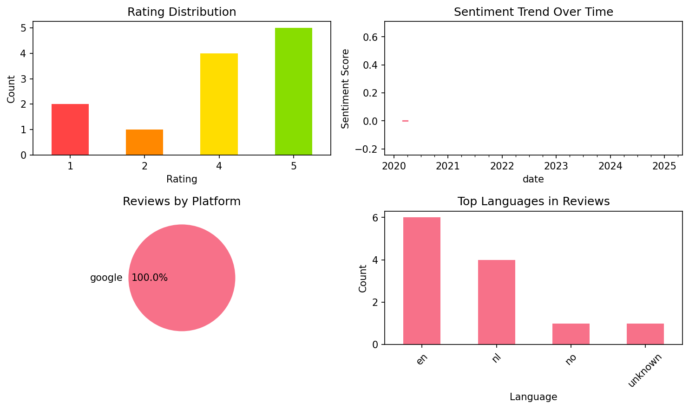

# Learn Spanish with flashcards!

## 📱 App Information

| **Attribute** | **Google Play** | **App Store** |
|---------------|-----------------|---------------|
| **Title** | Learn Spanish with flashcards! | N/A |
| **Package/ID** | ru.poas.spanishwords | N/A |
| **Rating** | 4.643564 | N/A |
| **Total Ratings** | 3,219 | N/A |
| **Installs** | 100,000+ | N/A |
| **Genre** | Education | N/A |

## 📝 Description

ReWord is a highly effective foreign language learning app. It is your best tool to learn Spanish and improve your vocabulary. Did you know you can learn languages just taking 5-10 minutes a day? With our interval system, your Spanish lessons will reach a new level. And will give you greater results, of course!

As with any other language, Spanish lessons must include learning Spanish grammar and memorizing new Spanish words. However, one of the problems with foreign language learning is you can’t achieve good results if you don’t systematize the memorizing.
With ReWord, you get a dedicated system and will memorize new Spanish words without much effort on your part.

Features:
• 5000 words vocabulary. Thousands of Spanish words and phrases divided into thematic categories: choose the category you want to learn this time and change it whenever you want.
• Add your own words and categories easily: you can create your own word base you want to master first.
• Handy Spanish flashcards with pictures and example sentences: helpful mental shortcuts to build your vocabulary and understand the nuances of word meaning and how these words are used in real practice.
• Spaced repetitions really work: ReWord has a science-based approach to memorizing foreign words so you can learn languages at the highest efficiency.
• Tracking your progress: set your daily goal and keep achieving it every day.
• Learn Spanish offline: now it is possible to improve your vocab wherever you go.

Yes, with ReWord, memorizing new words is extremely easy and utterly efficient!

Use the app at least twice a day, with regular breaks every few hours. Start with just five words a day and you will have at least 1,825 new words in your active vocabulary within a year. Increase your daily goal, take more Spanish lessons, and you will accelerate your progress and learn Spanish even faster.
ReWord – your best foreign language learning app! We are here to help you learn languages in a hassle-free way! Start to speak Español!

## 📊 Reviews Analytics

**Total Reviews:** 12 (12 analyzed)
**Rating Distribution:** 9 positive (4-5★), 0 neutral (3★), 3 negative (1-2★)
**Average Sentiment:** 0.11 (-1=very negative, +1=very positive)
**Primary Language:** en
**Key Insights:** Average rating: 3.8/5.0 | Overall sentiment: positive (score: 0.11) | Reviews in 4 languages, primarily en (6 reviews) | Reviews from 1 platform(s): google | Key themes: words, free, app


### 🔑 Key Themes & Phrases

- **words** (relevance: 0.147)
- **free** (relevance: 0.146)
- **app** (relevance: 0.146)
- **te** (relevance: 0.111)
- **fijn** (relevance: 0.107)
- **en** (relevance: 0.107)
- **great** (relevance: 0.093)
- **version** (relevance: 0.071)

### ⭐ Rating Breakdown

- **5 ★★★★★**: 5 reviews (41.7%)
- **4 ★★★★☆**: 4 reviews (33.3%)
- **2 ★★☆☆☆**: 1 reviews (8.3%)
- **1 ★☆☆☆☆**: 2 reviews (16.7%)

### 🌍 Languages in Reviews

- **en**: 6 reviews
- **nl**: 4 reviews
- **no**: 1 reviews
- **unknown**: 1 reviews

### 📱 Platform Distribution

- **google**: 12 reviews

## 📈 Visualizations

### Analytics Charts


### Word Cloud


## 💬 Sample Reviews

**Review 1** (★★ - google - 2025-05-13T00:04:27)
> Great, until you realise there's a limit to the amounts of words you can learn per day in the free version. I'm not paying to learn vocabulary. It was great while it lasted, bye.

**Review 2** (★★★★★ - google - 2024-07-08T12:06:24)
> Handig!! Werkt prettig!!!

**Review 3** (★★★★ - google - 2021-02-26T17:59:10)
> My favourite app so far for improving my vocabulary. There is a large amount of common spanish words available, and if you want you can add your own list of words as well. Furthermore, the app makes great use of spaced repetition to make sure you really remember the words. One thing I noticed, thoug...

**Review 4** (★★★★★ - google - 2020-04-28T11:16:56)
> Goede app om je woordenschat te vergroten

**Review 5** (★★★★★ - google - 2019-11-01T09:40:08)
> Exactly what i wanted

## 🔧 Raw JSON Data

<details>
<summary>Click to expand raw app data</summary>

```json
{
  "name": "Learn Spanish with flashcards!",
  "google_package": "ru.poas.spanishwords",
  "google": {
    "title": "Learn Spanish with flashcards!",
    "description": "ReWord is a highly effective foreign language learning app. It is your best tool to learn Spanish and improve your vocabulary. Did you know you can learn languages just taking 5-10 minutes a day? With our interval system, your Spanish lessons will reach a new level. And will give you greater results, of course!\r\n\r\nAs with any other language, Spanish lessons must include learning Spanish grammar and memorizing new Spanish words. However, one of the problems with foreign language learning is you can’t achieve good results if you don’t systematize the memorizing.\r\nWith ReWord, you get a dedicated system and will memorize new Spanish words without much effort on your part.\r\n\r\nFeatures:\r\n• 5000 words vocabulary. Thousands of Spanish words and phrases divided into thematic categories: choose the category you want to learn this time and change it whenever you want.\r\n• Add your own words and categories easily: you can create your own word base you want to master first.\r\n• Handy Spanish flashcards with pictures and example sentences: helpful mental shortcuts to build your vocabulary and understand the nuances of word meaning and how these words are used in real practice.\r\n• Spaced repetitions really work: ReWord has a science-based approach to memorizing foreign words so you can learn languages at the highest efficiency.\r\n• Tracking your progress: set your daily goal and keep achieving it every day.\r\n• Learn Spanish offline: now it is possible to improve your vocab wherever you go.\r\n\r\nYes, with ReWord, memorizing new words is extremely easy and utterly efficient!\r\n\r\nUse the app at least twice a day, with regular breaks every few hours. Start with just five words a day and you will have at least 1,825 new words in your active vocabulary within a year. Increase your daily goal, take more Spanish lessons, and you will accelerate your progress and learn Spanish even faster.\r\nReWord – your best foreign language learning app! We are here to help you learn languages in a hassle-free way! Start to speak Español!",
    "rating": 4.643564,
    "rating_text": null,
    "ratings_total": 3219,
    "ratings_histogram": [
      220,
      0,
      0,
      252,
      2738
    ],
    "installs": "100,000+",
    "genre": "Education"
  },
  "apple": null,
  "reviews": [
    {
      "platform": "google",
      "rating": 2,
      "review": "Great, until you realise there's a limit to the amounts of words you can learn per day in the free version. I'm not paying to learn vocabulary. It was great while it lasted, bye.",
      "date": "2025-05-13T00:04:27"
    },
    {
      "platform": "google",
      "rating": 5,
      "review": "Precies wat ik zocht, is me de eenmalige 5 euro wel waard",
      "date": "2025-03-08T23:24:07"
    },
    {
      "platform": "google",
      "rating": 5,
      "review": "Snel en makkelijk op te pakken. Fijn ook dat vervoegingen worden getoond",
      "date": "2024-09-16T14:02:00"
    },
    {
      "platform": "google",
      "rating": 5,
      "review": "Handig!! Werkt prettig!!!",
      "date": "2024-07-08T12:06:24"
    },
    {
      "platform": "google",
      "rating": 1,
      "review": "It's not free..",
      "date": "2023-12-28T15:58:56"
    },
    {
      "platform": "google",
      "rating": 4,
      "review": "Net begonnen en lijkt heel fijn",
      "date": "2023-07-31T14:05:38"
    },
    {
      "platform": "google",
      "rating": 4,
      "review": "My favourite app so far for improving my vocabulary. There is a large amount of common spanish words available, and if you want you can add your own list of words as well. Furthermore, the app makes great use of spaced repetition to make sure you really remember the words. One thing I noticed, though, is that for some other languages you added most common words up until the 'top 5000'. For spanish, you only added the top 1000 so far. A top 2000 or more would be a great addition!",
      "date": "2021-02-26T17:59:10"
    },
    {
      "platform": "google",
      "rating": 4,
      "review": "Its a good little app. Realy works for learning some basics words next to something like duolingo. Also no distracting fonts and pictures. You can set your own pase and enjoy the progress that way. Worth the buy.",
      "date": "2020-10-29T10:17:18"
    },
    {
      "platform": "google",
      "rating": 4,
      "review": "😀",
      "date": "2020-08-09T12:45:44"
    },
    {
      "platform": "google",
      "rating": 5,
      "review": "Goede app om je woordenschat te vergroten",
      "date": "2020-04-28T11:16:56"
    },
    {
      "platform": "google",
      "rating": 1,
      "review": "Paid for the add-free version, didn't get it. I tried clearing the data in the manage space part, but it still wouldn't work.",
      "date": "2020-03-13T20:38:12"
    },
    {
      "platform": "google",
      "rating": 5,
      "review": "Exactly what i wanted",
      "date": "2019-11-01T09:40:08"
    }
  ]
}
```

</details>

---
*Report generated on 2025-11-08 13:53:01 using advanced analytics*
