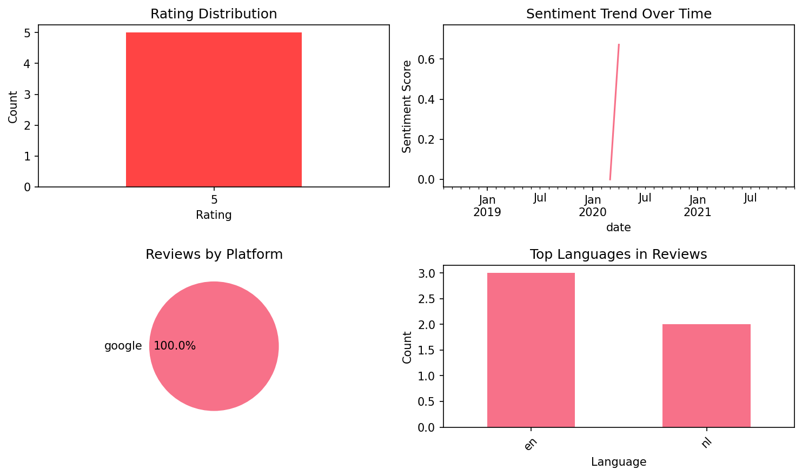
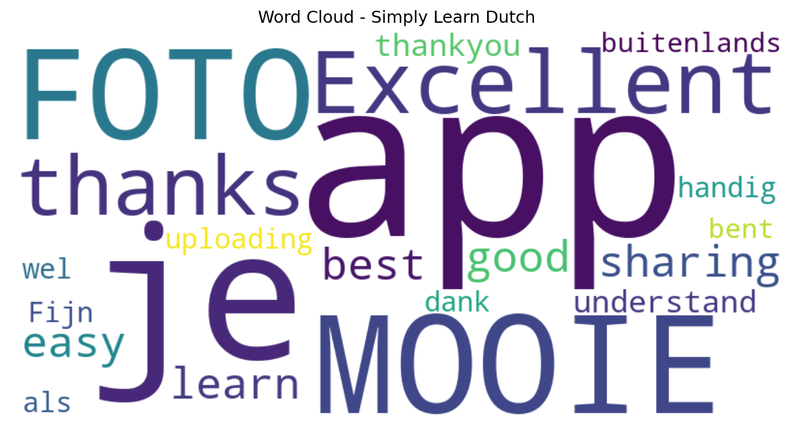

# Simply Learn Dutch

## 📱 App Information

| **Attribute** | **Google Play** | **App Store** |
|---------------|-----------------|---------------|
| **Title** | Simply Learn Dutch | N/A |
| **Package/ID** | simply.learn.dutch | N/A |
| **Rating** | 4.181818 | N/A |
| **Total Ratings** | 648 | N/A |
| **Installs** | 100,000+ | N/A |
| **Genre** | Travel & Local | N/A |

## 📝 Description

<b>TRY SIMPLY LEARN DUTCH NOW – DOWNLOAD THE APP & TRY FREE CATEGORIES </b>

<b>★★★ Learn Dutch language when visiting Netherlands ★★★</b><p></p>Simply Learn Dutch Language App is a <b>FREE</b> language app that will assist you to speak Dutch quickly and effectively.<p></p>All Dutch phrases and words are presented to you in both phonetic and original Dutch writing. They are recorded by a <b>native speaker from Netherlands</b>.<p></p>Save your favorite phrases and words to review them without fuss.<p></p>Study your vocabulary with flashcards using the spaced repetition technique.<p></p>Test your knowledge with fun Dutch language quiz and review your score.<p></p><b>★★★ Survive when travelling in Netherlands ★★★</b> <p></p>Use the Dutch phrasebook to survive in Netherlands. All important survival phrases are included.<p></p>For example, let the app speak to the Taxi driver in Netherlands to show them where you want to go.<p></p>Search all phrases and words to quickly access what you need.<p></p><b>★★★ Main Features ★★★</b><p></p>✓ 300+ free Dutch phrases and words
 ✓ Recorded by a native speaker from Netherlands
 ✓ High quality audio
 ✓ Spaced repetition learning system
 ✓ Dutch quiz to review your skills
 ✓ Track your learning progress
 ✓ Save your favorite phrases and words
 ✓ Quick search function
 ✓ Copy the phrases to the clipboard (by clicking long on the phrase)
 ✓ Play the sound more slowly
 ✓ Adjust the quiz and flashcards settings for Dutch to English, English to Dutch<p></p><b>★★★ Learning Categories ★★★</b> <p></p>FREE version:
 * Numbers * Time&Date * Basic Conversation * Greetings * Directions Phrases * Directions Words * Eating out in Netherlands * Sightseeing in Netherlands * Shopping in Netherlands * Emergency * Accommodation<p></p>PRO version:
 * Advanced Conversation * Health * Border Crossing * Questions * Places * Food * Vegetables * Fruits * Colors * Romance I * Romance II * Post Office * Phone & Internet * Banking * Occupations * Business Talk * Hobbies * Feelings * Body * Animals * Family * Countries<p></p><b>★★★ Feedback appreciated ★★★</b><p></p>If you like this app, please take a few seconds to give a rating or review. If you have any feedback, suggestions or advise I am more than happy if you let me know.<p></p><b>★★★About US★★★ </b><p></p>Website: www.simplylearnlanguages.com/dutch
 Facebook: www.facebook.com/simplylearnlanguages/
 Feedback: support@ling-app.com
 Privacy Policy: https://simplylearnapp.com/privacy.html <p></p>Have fun learning Dutch!<p></p>

## 📊 Reviews Analytics

**Total Reviews:** 5 (5 analyzed)
**Rating Distribution:** 5 positive (4-5★), 0 neutral (3★), 0 negative (1-2★)
**Average Sentiment:** 0.28 (-1=very negative, +1=very positive)
**Primary Language:** en
**Key Insights:** Average rating: 5.0/5.0 | Overall sentiment: positive (score: 0.28) | Reviews in 2 languages, primarily en (3 reviews) | Reviews from 1 platform(s): google | Key themes: je, app


### 🔑 Key Themes & Phrases

- **je** (relevance: 0.400)
- **app** (relevance: 0.400)

### ⭐ Rating Breakdown

- **5 ★★★★★**: 5 reviews (100.0%)

### 🌍 Languages in Reviews

- **en**: 3 reviews
- **nl**: 2 reviews

### 📱 Platform Distribution

- **google**: 5 reviews

## 📈 Visualizations

### Analytics Charts


### Word Cloud


## 💬 Sample Reviews

**Review 1** (★★★★★ - google - 2021-12-13T11:30:09)
> MOOIE FOTO

**Review 2** (★★★★★ - google - 2020-10-14T13:45:31)
> Excellent app thanks for sharing All the best 👍👍

**Review 3** (★★★★★ - google - 2020-04-18T15:06:05)
> Very good app easy to learn and understand thankyou for uploading this app.

**Review 4** (★★★★★ - google - 2020-03-23T21:06:56)
> Fijn, dank je wel

**Review 5** (★★★★★ - google - 2018-08-07T09:15:11)
> handig als je buitenlands bent

## 🔧 Raw JSON Data

<details>
<summary>Click to expand raw app data</summary>

```json
{
  "name": "Simply Learn Dutch",
  "google_package": "simply.learn.dutch",
  "google": {
    "title": "Simply Learn Dutch",
    "description": "<b>TRY SIMPLY LEARN DUTCH NOW – DOWNLOAD THE APP & TRY FREE CATEGORIES </b>\r\n\r\n<b>★★★ Learn Dutch language when visiting Netherlands ★★★</b><p></p>Simply Learn Dutch Language App is a <b>FREE</b> language app that will assist you to speak Dutch quickly and effectively.<p></p>All Dutch phrases and words are presented to you in both phonetic and original Dutch writing. They are recorded by a <b>native speaker from Netherlands</b>.<p></p>Save your favorite phrases and words to review them without fuss.<p></p>Study your vocabulary with flashcards using the spaced repetition technique.<p></p>Test your knowledge with fun Dutch language quiz and review your score.<p></p><b>★★★ Survive when travelling in Netherlands ★★★</b> <p></p>Use the Dutch phrasebook to survive in Netherlands. All important survival phrases are included.<p></p>For example, let the app speak to the Taxi driver in Netherlands to show them where you want to go.<p></p>Search all phrases and words to quickly access what you need.<p></p><b>★★★ Main Features ★★★</b><p></p>✓ 300+ free Dutch phrases and words\r\n ✓ Recorded by a native speaker from Netherlands\r\n ✓ High quality audio\r\n ✓ Spaced repetition learning system\r\n ✓ Dutch quiz to review your skills\r\n ✓ Track your learning progress\r\n ✓ Save your favorite phrases and words\r\n ✓ Quick search function\r\n ✓ Copy the phrases to the clipboard (by clicking long on the phrase)\r\n ✓ Play the sound more slowly\r\n ✓ Adjust the quiz and flashcards settings for Dutch to English, English to Dutch<p></p><b>★★★ Learning Categories ★★★</b> <p></p>FREE version:\r\n * Numbers * Time&Date * Basic Conversation * Greetings * Directions Phrases * Directions Words * Eating out in Netherlands * Sightseeing in Netherlands * Shopping in Netherlands * Emergency * Accommodation<p></p>PRO version:\r\n * Advanced Conversation * Health * Border Crossing * Questions * Places * Food * Vegetables * Fruits * Colors * Romance I * Romance II * Post Office * Phone & Internet * Banking * Occupations * Business Talk * Hobbies * Feelings * Body * Animals * Family * Countries<p></p><b>★★★ Feedback appreciated ★★★</b><p></p>If you like this app, please take a few seconds to give a rating or review. If you have any feedback, suggestions or advise I am more than happy if you let me know.<p></p><b>★★★About US★★★ </b><p></p>Website: www.simplylearnlanguages.com/dutch\r\n Facebook: www.facebook.com/simplylearnlanguages/\r\n Feedback: support@ling-app.com\r\n Privacy Policy: https://simplylearnapp.com/privacy.html <p></p>Have fun learning Dutch!<p></p>",
    "rating": 4.181818,
    "rating_text": null,
    "ratings_total": 648,
    "ratings_histogram": [
      58,
      0,
      58,
      176,
      353
    ],
    "installs": "100,000+",
    "genre": "Travel & Local"
  },
  "apple": null,
  "reviews": [
    {
      "platform": "google",
      "rating": 5,
      "review": "MOOIE FOTO",
      "date": "2021-12-13T11:30:09"
    },
    {
      "platform": "google",
      "rating": 5,
      "review": "Excellent app thanks for sharing All the best 👍👍",
      "date": "2020-10-14T13:45:31"
    },
    {
      "platform": "google",
      "rating": 5,
      "review": "Very good app easy to learn and understand thankyou for uploading this app.",
      "date": "2020-04-18T15:06:05"
    },
    {
      "platform": "google",
      "rating": 5,
      "review": "Fijn, dank je wel",
      "date": "2020-03-23T21:06:56"
    },
    {
      "platform": "google",
      "rating": 5,
      "review": "handig als je buitenlands bent",
      "date": "2018-08-07T09:15:11"
    }
  ]
}
```

</details>

---
*Report generated on 2025-11-08 13:53:05 using advanced analytics*
