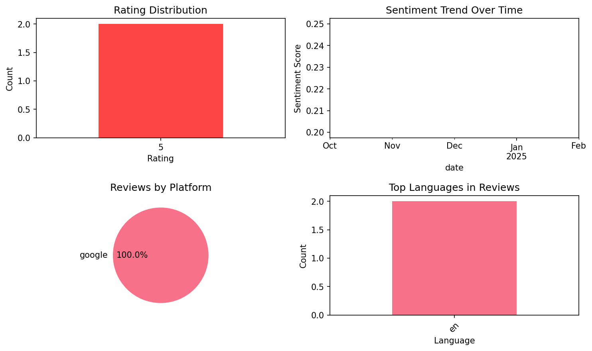

# Vocabulary flashcards: Vocabuo

## 📱 App Information

| **Attribute** | **Google Play** | **App Store** |
|---------------|-----------------|---------------|
| **Title** | Vocabulary flashcards: Vocabuo | N/A |
| **Package/ID** | world.petr.vokabeln | N/A |
| **Rating** | 4.5652175 | N/A |
| **Total Ratings** | 334 | N/A |
| **Installs** | 10,000+ | N/A |
| **Genre** | Education | N/A |

## 📝 Description

Learn English, Spanish, German, French, Italian or Swedish words through smart flashcards. See word's usage in infinite amount of sentences and learn through proven spaced-repetition method. 

Create collections of English, Spanish, German, French, Italian and Swedish vocabulary from any piece of text you'd like. Be it news articles, song lyrics, ebooks or short stories. Vocabuo will extract the words in their basic forms, taking conjugations and prefixes into account, and prepares them for practice. 

Practice with flashcards by simply swiping left or right. Cycle though unlimited amount of sentences to get the best feeling for the word. Obtain more information about the word's meaning, origin and related words by clicking the explanation button! Hear the proper pronunciation of each sentence, immediately after revealing the answer. 

Add more vocabulary from videos or by reading your favorite websites.

## 📊 Reviews Analytics

**Total Reviews:** 2 (2 analyzed)
**Rating Distribution:** 2 positive (4-5★), 0 neutral (3★), 0 negative (1-2★)
**Average Sentiment:** 0.22 (-1=very negative, +1=very positive)
**Primary Language:** en
**Key Insights:** Average rating: 5.0/5.0 | Overall sentiment: positive (score: 0.22) | Reviews from 1 platform(s): google

### ⭐ Rating Breakdown

- **5 ★★★★★**: 2 reviews (100.0%)

### 🌍 Languages in Reviews

- **en**: 2 reviews

### 📱 Platform Distribution

- **google**: 2 reviews

## 📈 Visualizations

### Analytics Charts


### Word Cloud


## 💬 Sample Reviews

**Review 1** (★★★★★ - google - 2025-02-16T23:25:38)
> I've tried many similar apps but this app does it in terms of simplicity and effectiveness.

**Review 2** (★★★★★ - google - 2024-10-15T14:18:14)
> The only thing that this app still needs for me to give it 5 stars is the ability to make your own flashcards without the app having to recognize it as a word. I can't make complete collections of words I encounter in books or TV shows because the app will not recognize some of them as Spanish words...

## 🔧 Raw JSON Data

<details>
<summary>Click to expand raw app data</summary>

```json
{
  "name": "Vocabulary flashcards: Vocabuo",
  "google_package": "world.petr.vokabeln",
  "google": {
    "title": "Vocabulary flashcards: Vocabuo",
    "description": "Learn English, Spanish, German, French, Italian or Swedish words through smart flashcards. See word's usage in infinite amount of sentences and learn through proven spaced-repetition method. \r\n\r\nCreate collections of English, Spanish, German, French, Italian and Swedish vocabulary from any piece of text you'd like. Be it news articles, song lyrics, ebooks or short stories. Vocabuo will extract the words in their basic forms, taking conjugations and prefixes into account, and prepares them for practice. \r\n\r\nPractice with flashcards by simply swiping left or right. Cycle though unlimited amount of sentences to get the best feeling for the word. Obtain more information about the word's meaning, origin and related words by clicking the explanation button! Hear the proper pronunciation of each sentence, immediately after revealing the answer. \r\n\r\nAdd more vocabulary from videos or by reading your favorite websites.",
    "rating": 4.5652175,
    "rating_text": null,
    "ratings_total": 334,
    "ratings_histogram": [
      14,
      0,
      14,
      58,
      246
    ],
    "installs": "10,000+",
    "genre": "Education"
  },
  "apple": null,
  "reviews": [
    {
      "platform": "google",
      "rating": 5,
      "review": "I've tried many similar apps but this app does it in terms of simplicity and effectiveness.",
      "date": "2025-02-16T23:25:38"
    },
    {
      "platform": "google",
      "rating": 5,
      "review": "The only thing that this app still needs for me to give it 5 stars is the ability to make your own flashcards without the app having to recognize it as a word. I can't make complete collections of words I encounter in books or TV shows because the app will not recognize some of them as Spanish words, but when I Google them I do get a translation. Also premade collections with common slang would be a great addition.",
      "date": "2024-10-15T14:18:14"
    }
  ]
}
```

</details>

---
*Report generated on 2025-11-08 13:53:10 using advanced analytics*
